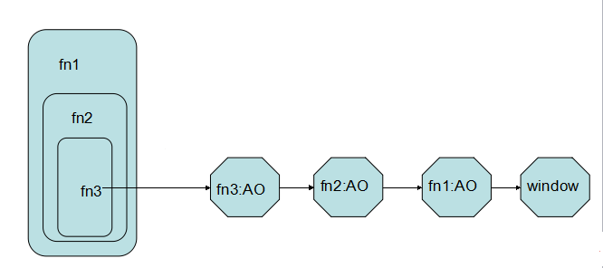

# 5.函数
####创建函数

##### 1) 函数声明 (预解析)

function MyFunc(){...}

##### 2) 函数表达式

var func = function MyFunc(){...}

自执行函数: ```(function(){...}())```


> 函数声明和函数表达式最重要的区别就是它们的名称标识符会绑定在何处？

>函数声明：被绑定在所在的作用域中

>函数表达式：被绑定在函数表达式自身的函数中


####arguments
函数实际上是访问了函数体中一个名为 arguments 的内部对象，这个对象就如同一个**类似于数组**的对象一样，包括了所有被传入的参数。

>      function avg() {
> 
>       var sum = 0;
>    
>       for (var i = 0, j = arguments.length; i < j; i++) {
>    
>           sum += arguments[i];
>       }
>    
>       return sum / arguments.length;
>       }
> 
> avg(2, 3, 4, 5); // 3.5
> 
> avg.apply(null, [2, 3, 4, 5]); // 3.5
> 
> avg.call(null, 2, 3, 4, 5); // 3.5

####作用域

JavaScript中，变量的作用域有全局作用域（window）和局部作用域（函数封装）两种。

1、函数被调用时，它是运行在他被声明时的语法环境中的；

2、函数自己无法运行，它总是被对象调用的，函数运行时，函数体内的**this**指针指向调用该函数的对象，如果调用函数时没有明确指定该对象， this 默认指向 window；

3、函数是一种带有可执行代码的对象类型数据（**函数就是对象**）。

***用函数来封装私有变量！***

***用函数来解决命名冲突!***

Tips: ```for(var i = 0; i<len; i++){}```

####作用域链



