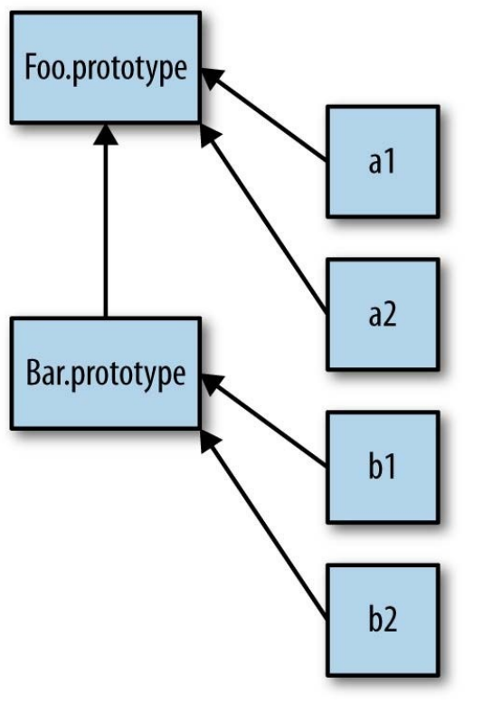

# 6.原型

**什么是原型？**

原型是一个对象，其他对象可以通过它实现属性继承。

**任何一个对象都可以成为原型么？**

是

**哪些对象有原型**

所有的对象在默认的情况下都有一个原型，因为原型本身也是对象，所以每个原型自身又有一个原型(只有一种例外，默认的对象原型在原型链的顶端)

####prototype

    function Foo(){}
    Foo.prototype; // 这个对象是在调用new Foo()时创建的，最后会被关联到这个“Foo.prototype”对象上
    Object.getPrototypeOf(a) === Foo.prototype;	//true
    
####原型继承 (通过原型链实现)
在面向类的语言中，类可以被复制（或者说实例化）多次，就像用模具制作东西一样。一个类就意味着“把类的行为复制到物理对象
中”，对于每一个新实例来说都会重复这个过程。

但是在JavaScript中，并没有类似的复制机制。

JavaScript会在两个对象之间创建一个**关联**，这样一个对象就可以通过委托访问另一个对象的属性和函数

    function Foo(name)	{	
		this.name = name;
    }
    Foo.prototype.myName = function()	{	
		return this.name;
    };	
    var a = new Foo("a");
    var b = new Foo("b");	
    a.myName();	//"a"
    b.myName();	//"b"
    
####原型链

如果在对象上没有找到需要的属性或者方法引用，引擎就会继续在[[Prototype]]关联的对象上进行查找。同理，如果在后者中也没有找到需要的引用就会继续查找它的[[Prototype]]，以此类推。

一个典型的通过原型链实现继承的例子：

    function Foo(name)	{	
		this.name = name;
    }
    Foo.prototype.myName = function(){	
		return this.name;
    };
     function Bar(name,label){	
		Foo.call(this,name);	
		this.label = label;
    }
    Bar.prototype = Object.create(Foo.prototype);
    Bar.prototype.myLabel = function(){	
		return this.label;
    };
    var a = new Bar("a","obj a");
    a.myName(); //"a"	
    a.myLabel(); //"obj a"

