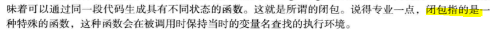

 # 闭包

 
 ####闭包定义
 

**  
1. 闭包是什么？答：一种特殊函数。
2. 闭包特点是什么？答：被调用时，保留其定义时候的作用域执行环境。
** 
 闭包是在某个作用域内定义的函数，它可以访问这个作用域内的所有变量。

    function foo(){
        var a = 2;
        function bar(){
          console.log(a);
        }
        return bar;
    }
    var baz = foo();
    baz();	//	2	

闭包作用域链通常包括三个部分：

1. 函数本身作用域。
2. 闭包定义时的作用域。
3. 全局作用域。

闭包常见用途：

1. 创建特权方法用于访问控制
2. 事件处理程序及回调
